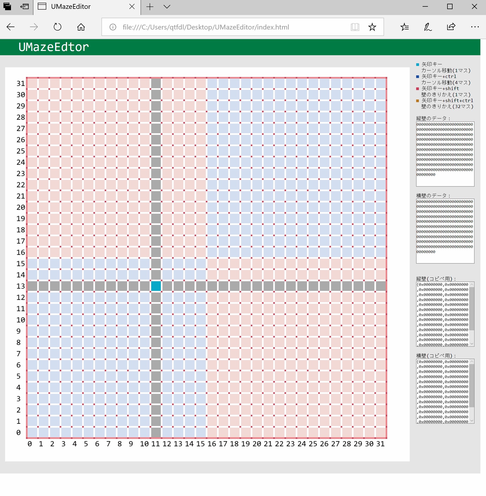

# UMazeEditor
マイクロマウス用の迷路データを作成するソフトです。

## 動かし方
UMazeEditor.htmlを適当なブラウザで開いてください。

## 壁のビットアサイン
以下のページにまとめられています。
http://www.robot-bibimbap.com/dokuwiki/doku.php?id=%E5%A3%81%E6%83%85%E5%A0%B1%E4%BF%9D%E6%8C%81%E4%BB%95%E6%A7%98